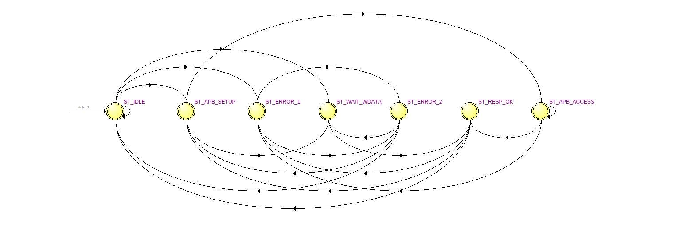

# AHB-to-APB Bridge UVM

This repository contains the active SystemVerilog AHB-to-APB bridge RTL, a structured UVM environment, archived Questa evidence, and a Quartus low-I/O signoff wrapper.

`edaplayground/design.sv` is the RTL source of truth. `edaplayground/result/` is kept as evidence, not as source.

## Project Snapshot

| Area | Status |
| --- | --- |
| RTL source | `edaplayground/design.sv` |
| Local UVM | `tb/` + `sim/` |
| EDA bundle | `edaplayground/testbench.sv` + `edaplayground/run.bash` |
| Quartus signoff | `quartus_fmax/bridge_core_fmax.qpf` |
| Architecture doc | `docs/architecture_overview.md` |
| Timing evidence | `docs/timing_signoff_status.md` |
| Archived Questa evidence | `docs/eda_playground_result.md` |

## What We Built

- A 32-bit, 3-slave AHB-to-APB bridge.
- One buffered request at a time, with registered readback.
- Local decode/alignment checking before any APB transaction.
- One-hot APB select generation with `PREADY`, `PSLVERR`, `PSTRB`, and `PPROT` support.
- A two-cycle AHB `ERROR` path for local faults and APB errors.

## What The Evidence Says

### UVM Run

The archived seed-1 randomized run is not just a raw pass/fail line. It shows that the bridge handled mixed valid and invalid traffic, APB wait states, and APB errors while draining the scoreboard cleanly.

| Result | Meaning |
| --- | --- |
| `UVM_WARNING=0`, `UVM_ERROR=0`, `UVM_FATAL=0` | The run completed cleanly. |
| AHB bus coverage `100.00%` | The tracked bridge AHB space was fully exercised. |
| AHB accepted-transfer coverage `98.75%` | Almost every accepted-transfer bin was hit. |
| AHB aggregate coverage `99.38%` | The overall AHB coverage picture was near-complete. |
| APB coverage `100.00%` | The APB side was fully exercised for the tracked bins. |
| Scoreboard `pending=0` | No request was left hanging at end of run. |

The scoreboard summary from the log is the real behavioral proof:

| Counter | Value |
| --- | --- |
| `ahb_valid` | `508` |
| `ahb_invalid` | `583` |
| `local_error` | `583` |
| `apb_setup` | `508` |
| `apb_enable` | `1255` |
| `apb_wait` | `747` |
| `apb_error` | `72` |
| `ahb_resp_checks` | `1746` |
| `hrdata_checks` | `208` |

Assertion coverage from the archived `vcover` report:

| Block | Coverage |
| --- | --- |
| `bridge_7state_core` | `87.09%` |
| `bridge_assertions` | `86.36%` |

Log excerpt:

```text
# UVM_INFO testbench.sv(1723) @ 116015000: uvm_test_top.env.cov [COV] AHB bus coverage = 100.00%
# UVM_INFO testbench.sv(1724) @ 116015000: uvm_test_top.env.cov [COV] AHB accepted-transfer coverage = 98.75%
# UVM_INFO testbench.sv(1725) @ 116015000: uvm_test_top.env.cov [COV] AHB aggregate coverage = 99.38%
# UVM_INFO testbench.sv(1729) @ 116015000: uvm_test_top.env.cov [COV] APB coverage = 100.00%
# UVM_INFO testbench.sv(1866) @ 116015000: uvm_test_top.env.cov [SPEC_COV] All tracked spec coverage bins were hit in this run
# UVM_INFO testbench.sv(1274) @ 116015000: uvm_test_top.env.scb [SCB] Summary: ahb_valid=508 ahb_invalid=583 local_error=583 apb_setup=508 apb_enable=1255 apb_wait=747 apb_error=72 ahb_resp_checks=1746 hrdata_checks=208 pending=0 pending_rsp=0 have_setup=0
# --- UVM Report Summary ---
# UVM_INFO :  411
# UVM_WARNING :    0
# UVM_ERROR :    0
# UVM_FATAL :    0
```

### Architecture



The image is the actual control flow of the bridge. It is a 7-state buffered design:

| State | Meaning |
| --- | --- |
| `ST_IDLE` | Accept a new request or reject a bad one. |
| `ST_WAIT_WDATA` | Hold a write request until `HWDATA` arrives. |
| `ST_APB_SETUP` | Drive APB setup with one-hot `PSELx`. |
| `ST_APB_ACCESS` | Hold APB payload stable until `PREADY`. |
| `ST_RESP_OK` | Return a successful registered AHB response. |
| `ST_ERROR_1` | First cycle of the two-cycle AHB error response. |
| `ST_ERROR_2` | Second cycle of the two-cycle AHB error response; a new request can be accepted here. |

In plain terms: valid AHB requests are decoded, buffered, and forwarded to APB; invalid local requests never create APB traffic; successful reads return registered data; APB errors map back to a two-cycle AHB error.

Address map:

| AHB address range | APB select |
| --- | --- |
| `0x8000_0000` to `0x83FF_FFFF` | `Pselx[0]` |
| `0x8400_0000` to `0x87FF_FFFF` | `Pselx[1]` |
| `0x8800_0000` to `0x8BFF_FFFF` | `Pselx[2]` |
| Other addresses | local AHB `ERROR`, no APB transfer |

### Quartus Signoff

The Quartus wrapper is not just “it compiled”. It proves the active RTL fits and closes timing on a Cyclone V low-I/O wrapper.

| Result | Meaning |
| --- | --- |
| Quartus flow status | Successful |
| Fit completed | `Wed Jul 15 20:18:15 2026` |
| STA script completed | `Wed Jul 15 20:18:29 2026` |
| Setup slack | `+0.174 ns` |
| Hold slack | `+0.162 ns` |
| TNS | `0.000 ns` |
| Unconstrained clocks/ports | `0` |

Timing artifact:

| Artifact | Meaning |
| --- | --- |
| `quartus_fmax/output_files_core/bridge_core_fmax.postfit_sta.short.summary` | Current post-fit timing summary |

Quartus log excerpt:

```text
; Flow status                     ; Successful - Wed Jul 15 20:18:15 2026
; Analysis & Synthesis            ; 00:00:01
; Fitter                          ; 00:00:22
; TimeQuest Timing Analyzer       ; 00:00:05
```

## How To Run

Local compile:

```sh
make -C sim compile
```

Local simulation:

```sh
make -C sim run TEST=bridge_ahb_apb4_random_test NUM_ITEMS=100 SEED=random
```

Archived EDA bundle:

```sh
cd edaplayground
MODE=single TEST=bridge_ahb_apb4_random_test SEEDS=1 bash run.bash
```

Quartus timing:

- Use `docs/timing_signoff_status.md` for the exact 64-bit compatibility environment and `postfit_sta_short.tcl` flow.

## Scope

This repo documents an educational AHB/APB bridge subset, not full AMBA Rev 2.0 compliance.

| Area | Current scope |
| --- | --- |
| `HBURST` | Sideband only |
| `HMASTLOCK` | Sideband only |
| `RETRY` / `SPLIT` | Not implemented |
| `PPROT[1]` | Hardwired secure |
| AMBA TIC/test interface | Not implemented |
| `USE_PCLKEN=1` | Supported in RTL, default verification profile is same-clock |

## Documentation

- `docs/dv_plan.md`
- `docs/architecture_overview.md`
- `docs/amba_rev2_compliance_matrix.md`
- `docs/eda_playground_notes.md`
- `docs/eda_playground_result.md`
- `docs/timing_signoff_status.md`
